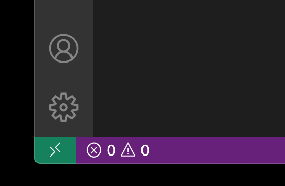
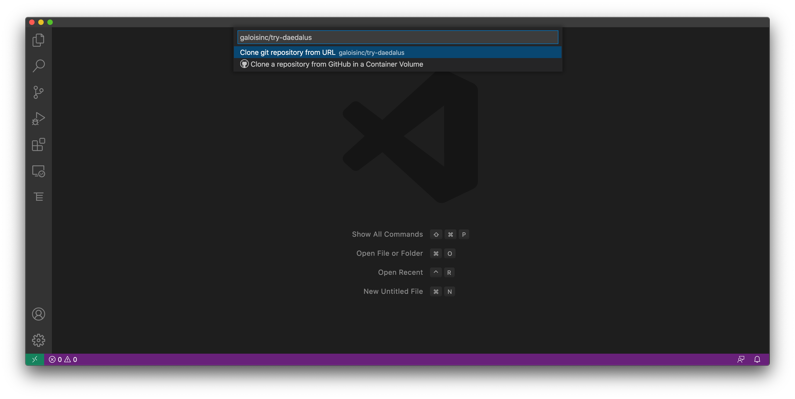
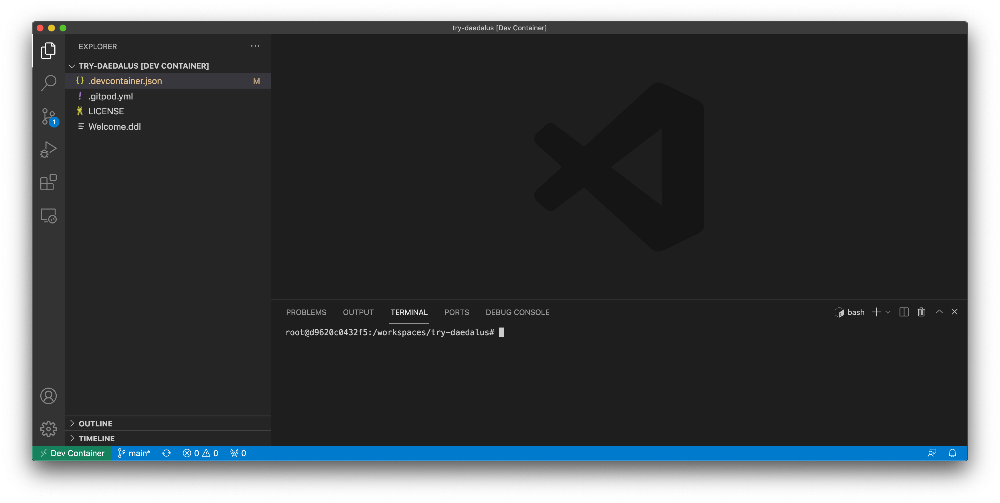

Try DaeDaLus
============

DaeDaLus_ (DDL) is a flexible data description language for generating
parsers with data dependencies.  This repository contains everything
you need (apart from VSCode) to try out DDL in Visual Studio Code.  In
particular, you will be able to write DDL parsers inside the IDE, and
also try out the parser on input.

.. _DaeDaLus: https://github.com/GaloisInc/daedalus

Getting Started
---------------

This repository uses VSCode's `remote container extension`_.  First
you must ensure this extension is installed; see the `Developing inside a Container`_ tutorial for detailed instructions.

.. _remote container extension: https://marketplace.visualstudio.com/items?itemName=ms-vscode-remote.remote-containers
.. _Developing inside a Container: https://code.visualstudio.com/docs/remote/containers

Once the remote container extension is installed, you should see a button in the bottom left of the VSCode window like this. |like this|

Click on this button and select 'Clone Repository in Container Volume...'.  This will bring up a dialogue, enter
'galoisinc/try-deadalus', like below. |open-repo|

After hitting enter, VSCode will download the `daedalus container`_
from DockerHub.  This contains a pre-built copy of the language server
which provides the IDE backend for DDL.  Once everything has completed
setting up, you will see a terminal running in the docker image and a
number of files in the explorer frame on the left hand side. |docker-started|

.. _daedalus container: https://hub.docker.com/repository/docker/galoisinc/daedalus

From there open 'Welcome.ddl' and follow the examples.

Next Steps
----------

The DaeDaLus_ repo comes with a number of larger DDL examples,
including PDF, NITF, and MIDI.
